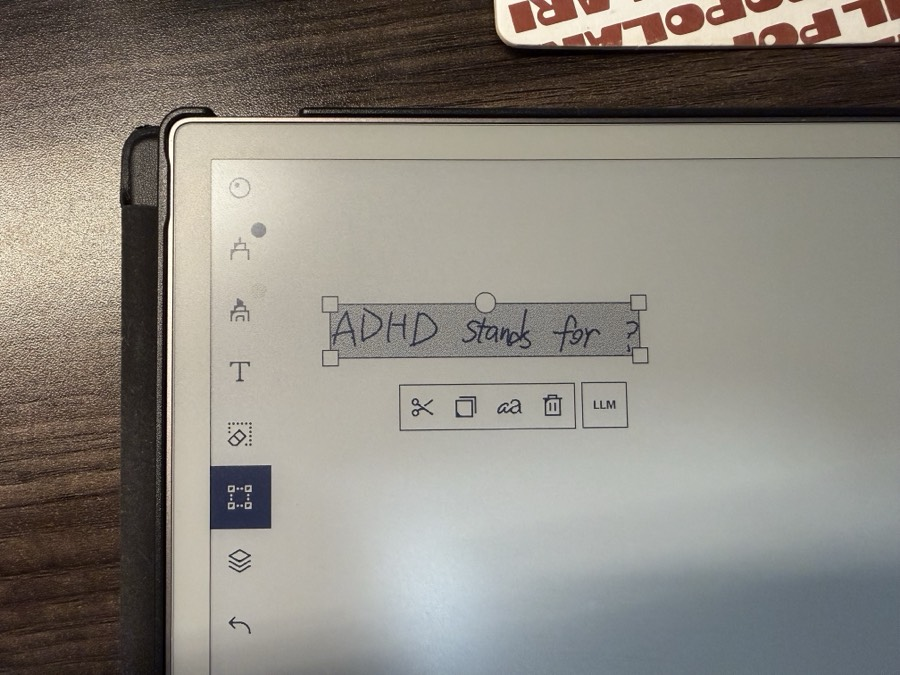
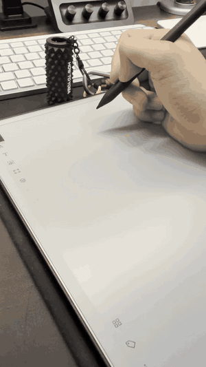

# Smart Remarkable

A Vision-LLM agent for the reMarkable tablet. It watches what you write, and
when you trigger it, sends a screenshot to an LLM and draws (or types) the
response back onto the screen.

This project is a fork of [awwaiid/ghostwriter](https://github.com/awwaiid/ghostwriter), extended with Select Mode.


It also has a **Select Mode**: lasso a region of handwriting, get an LLM
answer drawn into a box you choose. Because the answer is real pen strokes,
you can afterwards move and resize it with reMarkable's own selection tool.

**New: LLM button.** When you lasso text with reMarkable's own selection
tool, an **LLM** button now shows up right beside the usual cut/copy/paste
menu — tap it to kick off Select Mode on that selection, no corner tap or
gesture required. It's added by a small extension
(`xovi-ext/llmbutton`) that hooks into xochitl's UI.



**New: Draw button.** A second button, **Draw**, sits right beside the LLM
button (same extension). Lasso a region and tap it instead of LLM: if the
selection is mostly handwritten/typed text, it sketches a small pencil-scratch
doodle illustrating what you wrote, drawn below the selection; if the
selection is already a drawing or sketch, it erases the original and redraws
an improved, more detailed version of it in the same spot. See
[SELECT_MODE.md](SELECT_MODE.md) for details.

**New: image-generation drawing (`--image-model`).** By default the Draw
button's artwork is SVG written by the chat LLM, which tops out at schematic
line art. Pass `--image-model` (default `gemini-2.5-flash-image`, Google's
"nano banana") and the sketch is instead rendered by a real image-generation
model — the chat LLM only classifies the selection and writes the image
prompt — then skeleton-traced into pen strokes. Sketch enhancement becomes
true image-to-image: your lassoed drawing is attached to the request, and
the original strokes are removed via xochitl's own selection-delete before
the refined version draws in their place. Needs `GEMINI_API_KEY` or
`GOOGLE_API_KEY`.



## Contents

- [Features](#features)
- [Usage](#usage)
- [Install](#install)
- [LLM API Keys](#llm-api-keys)
- [Architecture](#architecture)
- [License](#license)
- [Credits](#credits)

## Features

- **Watch-and-draw loop.** A background task waits for a touch trigger (tap
  a screen corner, a four-finger tap, or a physical "LLM" button press — see
  below), screenshots the current page straight out of xochitl's
  framebuffer, sends it to a vision-capable LLM, and writes the answer back
  onto the screen — either typed via a virtual keyboard (`draw_text`) or
  hand-drawn as pen strokes from an LLM-generated SVG (`draw_svg`).

- **Select Mode** (`--select-mode`). Tap the trigger corner, then tap two
  opposite corners around a piece of handwriting to select it, then two more
  corners to choose where the answer should be drawn. The cropped selection
  is sent to the LLM, and the answer comes back as real ink scaled/centered
  into your placement box — genuine pen strokes you can move and resize
  afterward with reMarkable's native selection tool. See `SELECT_MODE.md`
  for the full walkthrough.

- **LLM button (`xovi-ext/llmbutton`).** A XOVI native extension
  (`llmbutton.so`) that hooks into the running `xochitl` process at the Qt
  scene-graph level and injects an "LLM" button next to the stock
  cut/copy/paste selection menu. Tapping it writes a trigger file
  (`/tmp/llm_button_trigger`) that kicks off Select Mode on the current
  selection — no corner tap needed.

- **Draw button** (same extension). A second injected button beside LLM.
  Tapping it after lassoing a region writes `/tmp/draw_button_trigger` and
  routes to `prompts/draw.json`'s `draw_sketch` tool instead of an LLM
  answer: if the selection is mostly text, the model draws an illustrative
  doodle below it; if the selection is already a drawing, the app erases
  the original ink and redraws an improved version in the same spot. See
  [SELECT_MODE.md](SELECT_MODE.md) for the full mechanics.

- **Image-generation drawing** (`--image-model`, `--image-api-key`).
  Reroutes the Draw button through an image-generation model (default
  `gemini-2.5-flash-image`, "nano banana"): the chat LLM classifies the
  selection and writes a detailed image prompt (`prompts/draw_image.json`),
  `src/image_gen.rs` calls the Gemini image API — attaching the upscaled,
  background-cleaned crop of your sketch in enhancement mode — and the
  returned line art is thresholded, thinned to a 1-px skeleton, and traced
  as pen strokes (`Pen::draw_bitmap_centerline`). For the in-place redraw,
  the original strokes are deleted exactly via xochitl's own selection menu
  (the app locates and taps its trash button; dense hardware-eraser sweeps
  are the fallback), and only after generation succeeded — a failed API
  call never destroys your sketch.

- **Rotation-aware input.** Each screenshot detects whether xochitl's UI is
  rendered 180° rotated (device held upside down), normalizes the image to
  the user's orientation for the LLM and marquee detection, and mirrors all
  synthetic pen/touch coordinates back at the injection boundary — so taps,
  erasing, and drawing land correctly either way you hold the tablet.

- **Web config UI** (`--web-server`, `--web-port`). A `warp`-based HTTP
  server (default port `8080`) serving a small static UI for viewing and
  live-editing the running config, applying changes immediately (in-memory,
  hot-reloaded via a watch channel, with in-flight LLM calls cancelled) and
  persisting them to `~/.smart_remarkable.toml`. Also exposes
  `POST /api/simulation/trigger` to fire a trigger manually without touching
  the device.

- **Image segmentation** (`--apply-segmentation`). Runs contour-based region
  detection (`imageproc`) over the screenshot before calling the LLM,
  appending a text description of detected ink regions to the prompt for
  better spatial grounding.

- **Anthropic-only extras: thinking and web search.** `--thinking` enables
  extended thinking (`--thinking-tokens`, default `5000`, sets the budget);
  `--web-search` gives Claude a server-side web-search tool (max 5 uses per
  call). Both are no-ops on OpenAI/Google engines.

- **Layered, persistable config.** `--save-config` writes the fully-resolved
  config (defaults < `~/.smart_remarkable.toml` < `SMART_REMARKABLE_*` env
  vars < CLI args) to `~/.smart_remarkable.toml` and exits, so you can bake
  in your preferred flags instead of retyping them every launch.

- **Simulation / offline testing.** `--input-png` swaps a live screenshot
  for a static image; `--test-mode <rm2|rmpp>` plus
  `--test-touch-events-file`, `--test-screenshot-dir`,
  `--test-auto-trigger-delay`, and `--test-interaction-log` let the entire
  touch→screenshot→LLM→draw pipeline run headlessly on a desktop, no
  hardware required. `--no-draw`, `--no-submit`, `--no-loop`, and
  `--no-trigger` combine for fully offline, single-shot runs (used by
  `run_eval.sh`'s evaluation harness).

## Usage

**Normal mode**, from an SSH session on the device:

```bash
ANTHROPIC_API_KEY=sk-... ./smart_remarkable
```

1. Write something on the page.
2. Tap the trigger corner (default upper-right; change with
   `--trigger-corner`).
3. The tool screenshots the page, sends it to the LLM, and types or draws
   the answer back onto the screen.

**Select Mode**:

```bash
ANTHROPIC_API_KEY=sk-... ./smart_remarkable --select-mode
```

1. Tap the trigger corner to arm.
2. Tap two opposite corners around the handwritten question (a minimum
   40px box is enforced, so imprecise taps are fine).
3. Tap two opposite corners of where the answer should be drawn.
4. The cropped selection is sent to the LLM; the answer is scaled and drawn
   as pen strokes into the placement box. Move/resize it afterward with
   xochitl's native selection tool.

There's no on-screen guidance between taps — the sequence is always
trigger → 2 selection taps → 2 placement taps. Run with `--log-level debug`
over SSH while you're learning the gesture.

**LLM button / Draw button**: with `xovi-ext/llmbutton` installed, lassoing
text with xochitl's own selection tool shows **LLM** and **Draw** buttons
beside cut/copy/paste — tap either to run Select Mode on that selection
without a corner-tap trigger, using the LLM-answer flow or the
sketch/redraw flow respectively.

**Key CLI flags**

| Flag | Default | Purpose |
|---|---|---|
| `--engine` | auto-guessed from `--model` | Force `openai` / `anthropic` / `google` |
| `-m, --model` | `claude-sonnet-4-6` | Model name |
| `--engine-base-url` | provider default | Override API base URL |
| `--engine-api-key` | from env var | API key |
| `--prompt` | `general.json` | Prompt template (auto-switches to `selection.json` in select mode) |
| `--select-mode` | off | Enable Select Mode |
| `--image-model` | off (`gemini-2.5-flash-image` if passed bare) | Render Draw-button sketches with an image-generation model |
| `--image-api-key` | `GEMINI_API_KEY` / `GOOGLE_API_KEY` | API key for the image model |
| `--trigger-corner` | `UR` | `UR`/`UL`/`LR`/`LL` |
| `--apply-segmentation` | off | Add CV-derived spatial hints to the prompt |
| `--web-search` / `--thinking` / `--thinking-tokens` | off / off / `5000` | Anthropic-only extras |
| `--web-server` / `--web-port` | off / `8080` | Live config UI/API |
| `--save-config` | off | Persist resolved config and exit |
| `--log-level` | `info` | `debug`, `trace`, etc. |
| `--input-png`, `--test-mode`, `--test-touch-events-file`, `--test-screenshot-dir`, `--test-auto-trigger-delay` | — | Offline simulation / testing |
| `--no-submit`, `--no-draw`, `--no-loop`, `--no-trigger` | off | Skip pieces of the pipeline for testing |
| `--debug-tap`, `--debug-drag`, `--debug-lasso`, `--debug-type`, `--debug-svg`, `--debug-erase` | — | One-shot device-I/O helpers, exit after running |

**Example commands**

```bash
# Run with Claude, corner trigger on upper-left, verbose logging
ANTHROPIC_API_KEY=sk-... ./smart_remarkable --trigger-corner UL --log-level debug

# Select Mode with a specific Gemini model and the web config UI enabled
GOOGLE_API_KEY=... ./smart_remarkable --select-mode -m gemini-2.5-pro --web-server

# Offline test against a saved screenshot, no drawing, single pass
./smart_remarkable --input-png ./test.png --no-draw --no-loop --no-trigger --no-submit

# Select Mode with nano-banana image generation for the Draw button
OPENAI_API_KEY=... GEMINI_API_KEY=... ./smart_remarkable --select-mode \
  --trigger-corner four-finger -m gpt-5.4 --image-model
```

## Install

**Toolchain**: Rust `1.92.0` (pinned in `.tool-versions`).

**Build locally**

```bash
cargo build --release
# or
./build.sh local
```

Binary: `target/release/smart_remarkable`.

**Cross-compile with Docker (`cross`)**

```bash
cargo install cross --git https://github.com/cross-rs/cross
rustup target add armv7-unknown-linux-gnueabihf aarch64-unknown-linux-gnu

# reMarkable 2 (armv7)
cross build --release --target=armv7-unknown-linux-gnueabihf
# or: ./build.sh

# Paper Pro (aarch64)
cross build --release --target=aarch64-unknown-linux-gnu
# or: ./build.sh rmpp
```

`build.sh` can also scp the result for you: pass a hostname as the first
argument (default `remarkable`); anything starting with `rmpp` builds/ships
aarch64 to `root@<host>`, anything else builds/ships armv7. E.g.
`./build.sh rmpp-mytablet` or `./build.sh 192.168.1.117`.

**Cross-compile without Docker (macOS, Paper Pro / aarch64 only)**

```bash
brew tap messense/macos-cross-toolchains && brew install aarch64-unknown-linux-gnu
rustup target add aarch64-unknown-linux-gnu
CARGO_TARGET_AARCH64_UNKNOWN_LINUX_GNU_LINKER=aarch64-unknown-linux-gnu-gcc \
  cargo build --release --target aarch64-unknown-linux-gnu
```

There's no verified Docker-free path for the reMarkable 2 (armv7) target in
this repo — `.cargo/config.toml` has a commented-out template for a
messense-style `arm-remarkable-linux-gnueabi-gcc` toolchain, but it isn't
filled in or active.

**Deploy via scp**

```bash
scp target/armv7-unknown-linux-gnueabihf/release/smart_remarkable root@<device-ip>:
# or
scp target/aarch64-unknown-linux-gnu/release/smart_remarkable root@<device-ip>:
```

Find the device IP and root password under Settings → Help → About on the
tablet.

**Run on-device**

```bash
ssh root@<device-ip>
ANTHROPIC_API_KEY=sk-... ./smart_remarkable --select-mode
```

- **Developer Mode is required** (Settings → General → Software →
  Advanced). Enabling it factory-resets the device and voids the warranty.
- Run in the background with `nohup ./smart_remarkable &`.
- **Paper Pro uinput note**: the bundled uinput kernel module auto-loads and
  is prebuilt for OS versions 3.16–3.18 and 3.22 (`utils/rmpp/uinput-3.16.ko`,
  `-3.17.ko`, `-3.18.ko`, `-3.22.ko`). Other OS versions may need a rebuilt
  module — see `utils/rmpp/`.

## LLM API Keys

Set whichever provider's key you plan to use as an environment variable, or
drop them in a local `.env` file (loaded via `dotenv`):

```bash
export OPENAI_API_KEY=your-key-here
export ANTHROPIC_API_KEY=your-key-here
export GOOGLE_API_KEY=your-key-here
export GEMINI_API_KEY=your-key-here   # image generation (--image-model); GOOGLE_API_KEY also works
```

Note: image generation is not in the Gemini free tier — the key's Google AI
Studio project needs billing enabled (`gemini-2.5-flash-image` is ~$0.04 per
image).

- `--engine` picks the backend explicitly (`openai`, `anthropic`,
  `google`). If omitted, it's guessed from the `--model` name's prefix
  (`gpt*` → openai, `claude*` → anthropic, `gemini*` → google); if it can't
  guess, it errors and asks you to pass `--engine`.
- `--engine-api-key` / `--engine-base-url` override the corresponding
  provider env var (`OPENAI_API_KEY`/`OPENAI_BASE_URL`,
  `ANTHROPIC_API_KEY`/`ANTHROPIC_BASE_URL`,
  `GOOGLE_API_KEY`/`GOOGLE_BASE_URL`). If neither the CLI flag nor the env
  var is set for the API key, the process will panic — there's no fallback.
  Base URLs do have hardcoded fallbacks (`api.openai.com`,
  `api.anthropic.com`, `generativelanguage.googleapis.com`).
- **Default model**: `claude-sonnet-4-6`, which auto-resolves to the
  `anthropic` engine when `--engine` isn't specified.

## Architecture

**Data flow**: touch trigger → screenshot → LLM → draw/type.

1. **Trigger** (`touch.rs`, `coordinator::trigger_task`) — waits on
   `/dev/input/eventN` for a corner-tap release, a four-finger tap, or an
   external write to `/tmp/llm_button_trigger` or `/tmp/draw_button_trigger`
   (from the `llmbutton` xovi extension). Which one fired is tracked as
   `touch::TriggerSource` (`Touch` / `LlmButton` / `DrawButton`) and threaded
   through `TriggerEvent`/`processing_task`, which picks `prompts/draw.json`
   over the configured `--prompt` only for `DrawButton`. In Select Mode it
   also collects the two pairs of corner taps defining the selection rect
   and the placement rect.
2. **Capture** (`screenshot.rs`) — reads `xochitl`'s framebuffer directly
   out of `/proc/<pid>/mem`, decodes/rotates/color-corrects it into a
   normalized 768×1024 PNG; can detect the native selection marquee via
   connected-component analysis.
3. **Coordinate** (`coordinator.rs`) — an async pipeline of `tokio` tasks
   (`trigger_task` → `processing_task` → `progress_task`) joined by
   `mpsc`/`watch` channels. `processing_task` optionally crops to the
   selection rect, optionally runs `segmenter.rs`, loads the JSON prompt
   template, and hands the base64 image + prompt to the LLM engine.
   `progress_task` types a "Thinking..." dot animation via the virtual
   keyboard while waiting.
4. **LLM call** (`src/llm_engine/`) — a shared `LLMEngine` trait
   abstracts over `openai.rs`, `anthropic.rs`, `google.rs`. Each builds a
   provider-specific tool-forcing request and invokes the callback for
   whichever tool the model calls: `draw_text`, `draw_svg`, `draw_answer`
   (structured line-based layout for Select Mode), or `draw_sketch` (Draw
   button — reports `selection_is_drawing` to pick doodle-below-selection
   vs. erase-and-redraw-in-place).
5. **Draw** (`pen.rs`, `keyboard.rs`) — `pen.rs` parses SVG via
   `resvg`/`usvg` (text-to-path) and `svg2polylines` (tracing), converting
   it into virtual pen strokes injected as raw `evdev` events; `skeleton.rs`
   offers an alternative centerline-tracing render path via Zhang-Suen
   thinning. For in-place redraws, `Pen::erase_rect` first sweeps
   `BTN_TOOL_RUBBER` (real eraser-tip hardware signal) passes across the
   box — xochitl ignores normal pen strokes as erasing regardless of the
   selected toolbar tool. `keyboard.rs` drives a `uinput` virtual keyboard
   to type text and the progress-dot animation.

**Key modules**

| Module | Responsibility |
|---|---|
| `main.rs` | CLI entry point, config/engine wiring, tool registration, restart-on-config-change loop, `--debug-*` one-shot helpers |
| `coordinator.rs` | Async task graph: trigger detection, progress reporting, screenshot→LLM→tool pipeline |
| `touch.rs` | Raw touch/evdev reading, corner/four-finger trigger detection, coordinate mapping, gesture helpers |
| `screenshot.rs` | Framebuffer capture, decode, selection-marquee detection, cropping |
| `pen.rs` | Virtual pen (`evdev`/uinput): SVG/bitmap rendering strategies |
| `keyboard.rs` | Virtual keyboard (`evdev`/uinput): text typing, progress-dot animation |
| `device.rs` | `DeviceModel` detection (RM2 / Paper Pro) and per-device constants |
| `segmenter.rs` | Contour-based region detection for spatial grounding |
| `skeleton.rs` | Zhang-Suen thinning / centerline tracing |
| `util.rs` | SVG↔bitmap rasterization, fit-to-rect logic, uinput setup |
| `llm_engine/` | `LLMEngine` trait + `openai.rs`/`anthropic.rs`/`google.rs` |
| `image_gen.rs` | Gemini image-generation client for `--image-model` (nano banana) |
| `config.rs` | Layered config via `figment`/`toml`, hot-reload watch channel |
| `cancellation.rs` | Cooperative cancellation tokens |
| `status.rs` | Shared status snapshot for the web UI |
| `web_server.rs` + `src/web/` | Optional `warp` HTTP server + static config UI |
| `simulation/` | Desktop stand-ins for touch/screenshot hardware, interaction logging |
| `src/bin/experiment.rs` | Secondary binary for ad-hoc experimentation |
| `embedded_assets.rs` | Bundles `prompts/*.json` into the compiled binary via `rust-embed` |

**Stack**: Rust + `tokio` async task graph; `clap` for CLI; `reqwest`/`ureq`
for LLM HTTP calls; `resvg`/`usvg`/`svg2polylines` for SVG-to-stroke
rendering; `evdev`/`uinput` for virtual touch/pen/keyboard devices;
`figment`/`toml` for layered config; `warp` for the optional web UI;
`cross`-rs (Docker) or the messense toolchain for cross-compilation to
armv7/aarch64; a `prompts/*.json` system (`general.json`, `selection.json`,
plus one `tool_*.json` schema per registered tool) that drives LLM
tool-calling across all three provider backends.

The **LLM/Draw button** extension (`xovi-ext/llmbutton`) is architecturally
separate: it's a standalone C shared object built against the XOVI
extension framework, loaded into the *stock* `xochitl` process itself
(resolving Qt6 symbols via `dlsym`, walking the live QtQuick scene graph to
inject both buttons into the native selection menu) rather than part of the
Rust `smart_remarkable` binary — the two communicate only via the
filesystem trigger files `/tmp/llm_button_trigger` and
`/tmp/draw_button_trigger`.

## License

MIT — see [LICENSE](LICENSE). The release binary also embeds a GPL-2.0
kernel module; see [THIRD_PARTY_LICENSES.md](THIRD_PARTY_LICENSES.md).

## Credits

Forked from [awwaiid/ghostwriter](https://github.com/awwaiid/ghostwriter).

References this project has drawn from:
* [Awesome reMarkable](https://github.com/reHackable/awesome-reMarkable)
* Screen capture adapted from [reSnap](https://github.com/cloudsftp/reSnap)
* Screen-drawing technique inspired by [rmkit lamp](https://github.com/rmkit-dev/rmkit/blob/master/src/lamp/main.cpy)
* SVG-to-PNG via [resvg](https://github.com/RazrFalcon/resvg)
* Virtual keyboard input via [rM-input-devices](https://github.com/pl-semiotics/rM-input-devices)
