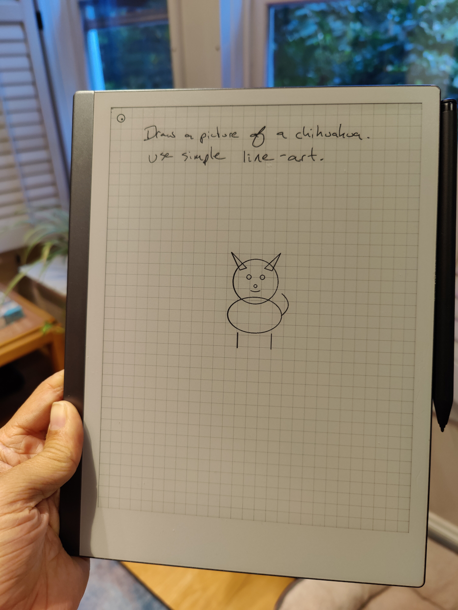
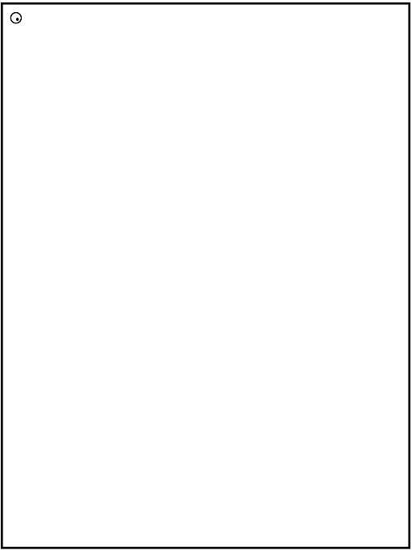

# Ghostwriter

A Vision-LLM agent for the reMarkable tablet. It watches what you write, and
when you trigger it, sends a screenshot to an LLM and draws (or types) the
response back onto the screen.



<b><i>Handwritten prompt by a human, chihuahua drawn by GPT-4o.</i></b>



It also has a **Select Mode**: lasso a region of handwriting, get an LLM
answer drawn into a box you choose. Because the answer is real pen strokes,
you can afterwards move and resize it with reMarkable's own selection tool.
See [SELECT_MODE.md](SELECT_MODE.md) for details.

## Contents

- [Install](#install)
- [LLM API key](#llm-api-key)
- [Usage](#usage)
- [CLI options](#cli-options)
- [Building from source](#building-from-source)
- [Project layout](#project-layout)

## Install

You need a rooted/developer-mode reMarkable (Settings → General → Software →
Advanced — enabling Developer Mode factory-resets the device). Find your
device's IP and SSH password under Settings → Help → About.

Grab a prebuilt binary from the
[Releases page](https://github.com/yangg1224/smart_remarkable/releases/latest)
on your computer (look for `ghostwriter-rm2` for the reMarkable 2, or
`ghostwriter-rmpp` for the Paper Pro), then copy it to the device:

```sh
# Copy it to the device (replace with your device's IP)
scp ghostwriter-rmpp root@192.168.1.117:ghostwriter
```

Then SSH in and make it executable:

```sh
ssh root@192.168.1.117
chmod +x ./ghostwriter
./ghostwriter --help
```

> No release built yet, or want the latest changes? See
> [Building from source](#building-from-source) and `scp` your own binary
> over instead.

## LLM API key

Ghostwriter needs an API key for whichever model provider you want to use.
You have two options — both are read on the **device**, not on your laptop:

**Option A — environment variable.** Add it to the device's `~/.bashrc`, or
just prefix the command:

```sh
export OPENAI_API_KEY=your-key-here      # for GPT models
export ANTHROPIC_API_KEY=your-key-here   # for Claude models
export GOOGLE_API_KEY=your-key-here      # for Gemini models
```

**Option B — `.env` file.** Create a file named `.env` next to the
`ghostwriter` binary on the device (e.g. `/home/root/.env`):

```
ANTHROPIC_API_KEY=your-key-here
```

You only need to set the key for the provider(s) you actually use. The
provider is auto-detected from the `--model` name (e.g. `claude-*` →
Anthropic, `gpt-*` → OpenAI, `gemini-*` → Google), or you can force it with
`--engine`. You can also pass a key directly with `--engine-api-key`, and
point at an OpenAI-compatible endpoint (Groq, Azure OpenAI, a local proxy,
etc.) with `--engine-base-url`.

## Usage

SSH into the reMarkable and run it:

```sh
# Use the default model (claude-sonnet-4-0)
./ghostwriter

# Use a specific model
./ghostwriter --model gpt-4o-mini
```

Draw something on the screen, then **tap the upper-right corner with your
finger** to trigger the assistant. Watch the SSH session for a log of what's
happening; you'll see progress dots drawn on screen, then a typed or
hand-drawn response.

To run it in the background:

```sh
nohup ./ghostwriter --model gpt-4o-mini &
```

For select mode (lasso a question, get the answer drawn into a box), see
[SELECT_MODE.md](SELECT_MODE.md).

## CLI options

**Models & engines**
* `--model MODEL` — model to use (default: `claude-sonnet-4-0`)
* `--engine ENGINE` — `openai`, `anthropic`, or `google` (auto-detected from model)
* `--engine-api-key KEY` — API key (alternative to env vars / `.env`)
* `--engine-base-url URL` — custom API base URL (e.g. for Groq, Azure, local proxies)

**Behavior**
* `--prompt PROMPT` — prompt file to use (default: `general.json`)
* `--trigger-corner CORNER` — touch trigger corner: `UR`, `UL`, `LR`, `LL`, or `four-finger` (default: `UR`)
* `--select-mode` — enable select mode (see [SELECT_MODE.md](SELECT_MODE.md))

**Tools**
* `--no-svg` — disable SVG drawing tool
* `--no-keyboard` — disable text output
* `--thinking` — enable model thinking (Anthropic)
* `--web-search` — enable web search (Anthropic)

**Debug / evaluation**
* `--log-level LEVEL` — `info`, `debug`, or `trace`
* `--no-loop` — run once and exit
* `--input-png FILE` — use a PNG file instead of a live screenshot
* `--output-file FILE` — save the text output to a file
* `--save-screenshot FILE` — save the screenshot
* `--save-bitmap FILE` — save the rendered output
* `--no-submit` — don't submit to the model
* `--no-draw` — don't draw the output
* `--no-trigger` — disable the touch trigger
* `--apply-segmentation` — add image segmentation for spatial awareness

Run `./ghostwriter --help` on the device for the full, current list.

## Building from source

You don't need Docker to cross-compile on macOS or Linux — the
[messense toolchains](https://github.com/messense/homebrew-macos-cross-toolchains)
work fine.

```sh
# One-time setup
rustup target add aarch64-unknown-linux-gnu armv7-unknown-linux-gnueabihf

# macOS
brew tap messense/macos-cross-toolchains
brew install aarch64-unknown-linux-gnu armv7-unknown-linux-gnueabihf

# Linux (Ubuntu/Debian)
sudo apt-get install gcc-aarch64-linux-gnu gcc-arm-linux-gnueabihf
```

Then build for your device:

```sh
# reMarkable Paper Pro (aarch64)
CARGO_TARGET_AARCH64_UNKNOWN_LINUX_GNU_LINKER=aarch64-unknown-linux-gnu-gcc \
  cargo build --release --target aarch64-unknown-linux-gnu

# reMarkable 2 (armv7)
CARGO_TARGET_ARMV7_UNKNOWN_LINUX_GNUEABIHF_LINKER=arm-linux-gnueabihf-gcc \
  cargo build --release --target armv7-unknown-linux-gnueabihf
```

Or use `cross` + Docker if you prefer (`./build.sh` / `./build.sh rmpp` —
see `build.sh`). Copy the resulting binary to your device with `scp`, as in
[Install](#install).

## Project layout

- `src/` — Rust source. `main.rs` is the entry point; `llm_engine/` has the
  OpenAI/Anthropic/Google backends; `screenshot.rs`, `pen.rs`, `touch.rs`,
  `keyboard.rs` handle device interaction; `segmenter.rs` and `util.rs` do
  image processing.
- `prompts/` — JSON prompt/tool definitions, bundled into the binary and
  overridable at runtime by copying a modified file to the device.
- `evaluations/` / `evaluation_results/` / `run_eval.sh` — a small evaluation
  harness for comparing models/prompts on saved screenshots.
- `utils/` — prebuilt `uinput` kernel modules for the Paper Pro (needed for
  virtual-keyboard input on OS versions that don't ship it).

## License

MIT — see [LICENSE](LICENSE).

## Credits

References this project has drawn from:
* [Awesome reMarkable](https://github.com/reHackable/awesome-reMarkable)
* Screen capture adapted from [reSnap](https://github.com/cloudsftp/reSnap)
* Screen-drawing technique inspired by [rmkit lamp](https://github.com/rmkit-dev/rmkit/blob/master/src/lamp/main.cpy)
* SVG-to-PNG via [resvg](https://github.com/RazrFalcon/resvg)
* Virtual keyboard input via [rM-input-devices](https://github.com/pl-semiotics/rM-input-devices)
